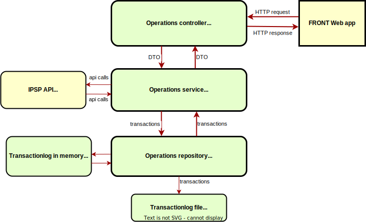
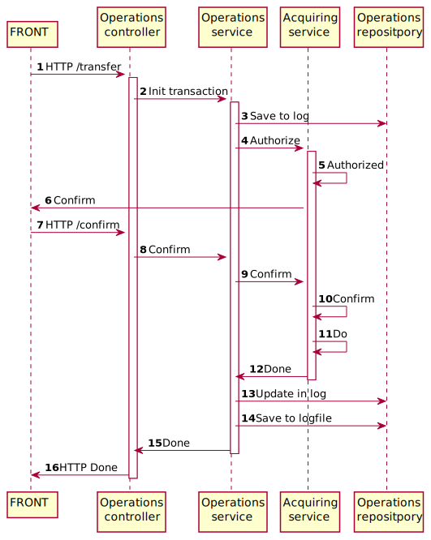

## Резюме
Репозиторий содержит выполнение курсового проекта "Сервис перевода денег с карты на карту" по курсу "Spring Boot, 
deployment и инфраструктура" учебной программы "Java разработчик" в netology.ru.
## Постановка задачи
Требования к заданию изложены [здесь](./TaskDescription.md)
## Описание архитектуры решения
Ниже представлена компонентная схема приложения 
Это классическая трехслойная архитектура Spring Web MVC, состоящая из трех ключевых компонентов: Controller, Service, 
Repository.   

<b>OperationsController</b>:

- обеспечивает экспозицию необходимых эндпонитов для обращения к ним клиентского приложения (FRONT),
- извлекает из получаемых HTTP запросов данные, необходимые для выполнения перевода денег с карты на карту  
(транзакций), 
- вызывает и получает ответы о результатах вызовов из компонента OperationService,
- формирует HTTP ответ во FRONT на основании данных о выполнении/ошибке выполнения транзакции, полученных от 
OperationService, а так же в случае возникновения ошибки в других компонентах приложения. 
OperationsController и OperationsService обмениваются друг с другом данными в виде DTO, подготовленных для всех типов 
запросов и ответов от одного сервиса к другому.

<b>OperationsService</b>:
- формирует и выполняет запрос на выполнение транзакции к "внешнему" сервису IPSP API. 
- получает от внешнего сервиса IPSP API результат выполнения транзакции и формирует ответ контроллеру OperationsController
в требуемым им формате.  
- формирует и выполняет запрос к OperationsRepository для записи транзакции в лог транзакций в памяти и записи ее в
файл журнала транзакций.
Выполнение транзакций состоит из двух этапов, выполняемых последовательно, каждый из которых реализован отдельным методом.
Первый (`OperationService.transfer`) - это обработка первоначального запроса на авторизацию транзакции, второй -
(`OperationService.confirmOperation`) - это обработка запроса на верификацию кода подтверждения от клиента, в случае
успешного завершения первого этапа. Сервис IPSP API, точнее его заглушка, реализован компонентом `AcuiringService`.
Он эмулирует поведение реального платежного сервиса, чтобы наше приложение можно было запустить и проверить его работу
в режиме prod (по сути - это mock).

<b>OperationsRepository</b>:
- записывает транзакцию в лог транзакций в памяти, а также предоставляет методы для получения транзакции по ее id из
лога и метод для обновления статуса транзакции.
- записывает транзакцию в файл журнала транзакций.  

В дополнении к основным компонентам описанным выше, реализован компонент LogAspect. Он определяет правила генерации 
и формирования содержания сообщений выводимых в лог консоли во время работы приложения в дополнении к стандартному 
логу консоли Spring Boot. Так же с помощью настройки в `application.properties` настроена запись лога консоли в файл.

Полный набор данных карт, достаточный для проведения переводов, нигде в приложении не хранится. В логе транзакций в
памяти хранятся только: идентификатор операции, номера карт, дата и время транзакции, сумма, валюта, результат согласно
классу `Transaction`. В файле журнала транзакций записывается та же информация в формате: 
`3,2022-04-05T01:13:19.256945500,1111-1111-1111-1111,1111-1111-1111-1111,100000.00,RUR,success` 
Полная информация о передаваемых в приложение данных карт выводится только в логе консоли, если приложение собрано со
значением свойства `application.profile.dev` = `true`.

Ниже представлена диаграмма последовательностей процесса обработки транзакции:

## Описание тестов
## Описание запуска приложения

